# altinn-design-system

Design system v2

## Getting started

### Node and Corepack

We are using the latest LTS release of node, but minimum version 16.9.0, since we are using [corepack](https://nodejs.org/api/corepack.html). To enable corepack, execute `corepack enable` from the terminal.

### Start Storybook

Execute `yarn start` to start Storybook. It should open a browser automatically when it is ready. If you prefer to not automatically open a browser, you can execute `yarn start --no-open`.

### Tests

- `yarn test` to run unit tests
- `yarn lint` to run lint checks

Lint checks and auto-fixes will be run automatically on commit.

### Adding new components

New components can be added by executing `yarn add-component <ComponentName>`. The name of the component should be written using PascalCase. This will generate all important files for you in the correct location, and also update the index file for exporting the component. The generated code includes some `TODO` statements that you should fix.

#### Adding new dependencies

When adding new dependencies, you should also add that dependency to the `external` array in `rollup.config.js`. This is done to avoid having the dependency being part of the bundle.

### Styling

Styling should primarily be done in css files using css variables. The css files should end with `.module.css`, so unique classnames will be generated. This ensures we will not run into naming collision issues with classnames.

We are using Figma as our design tool, and we are extracting tokens directly from Figma that can be used in code. These tokens are defined in the [figma-design-tokens repository](https://github.com/Altinn/figma-design-tokens). New components should ideally be using design tokens from there to define their layout. Before work is started on the component, you should discuss with the UX group first, because they need to define the tokens for the components.

#### Classname naming conventions

Using [BEM naming convention](http://getbem.com/naming/) gives a pretty clear view of what parts are the "root" and what parts are the "children", and is preferred. This also helps you think about when a component grows too big, and should be split into smaller isolated parts.

## Good to know

### How are the Figma design tokens connected to this repo?

The design tokens live in a [separate repository](https://github.com/Altinn/figma-design-tokens), which is used in Figma with a plugin. The UX group will set/use these tokens in their design, and in the end it will be synced to the `tokens.json` in the `figma-design-tokens` repository. These tokens are publised to NPM as a package `@altinn/figma-design-tokens`. During this process, the `tokens.json` is transformed to `tokens.esm.js` and `tokens.css` files, so the values can be used directly from JS or as CSS variables.

When using these tokens in this project, we are also transforming the values a bit, to stay compatible with our old design system. The long term goal is to get rid of the dependency to the old design system, so we no longer have to do this transformation. For more information about this, see the below explaination `rem` values.

### `rem` values

The design system currently has a dependency that redefines the base value of the `rem` unit (usually this corresponds to `16px`, but it is redefined so that `1rem` = `10px`). Since the design tokens from [figma-design-tokens](https://github.com/Altinn/figma-design-tokens) are defined in the assumption that `1rem` should be `16px`, the token values are recalculated automatically so that they maintain their expected pixel dimensions even though the `rem`/`px` ratio is different.

In the future we plan to remove this dependency that maps `1rem` to `10px`, which should simplify integration with different tools that might assume `1rem` = `16px` (e.g. Figma).

This means that CSS within the design system should avoid using `rem` values directly. Instead, always use token values (via CSS variables or JSON), which will be recalculated to the correct `rem`/`px` ratio. _**This is also true for applications that consume this design system.**_

TL;DR: don't define `rem` values in code; they should always come from design tokens.

The diagram below explains the transformation of `rem` values:

## Code style

We use [eslint](https://eslint.org/) and [prettier](https://prettier.io/), and automatically set up git hooks to enforce
these on commits. To avoid confusion, it is recommended to set this up your IDE.

### Visual Studio Code

Install the [eslint extension from the marketplace](https://marketplace.visualstudio.com/items?itemName=dbaeumer.vscode-eslint).

### WebStorm and IntelliJ IDEA

Configure your IDE to run `eslint --fix` on save (prettier will also reformat your code when doing this). It is also recommended to
[set up Prettier as the default formatter](https://www.jetbrains.com/help/webstorm/prettier.html#ws_prettier_default_formatter).

## Creating a new release

Go to Github Actions, and select the Release pipeline. Run the workflow, and select the appropriate version (major, minor or patch). We use [semver](https://semver.org/) spec.

### Release notes

Currently release notes is semi-automatic. After the release is done, go to the releases page, and edit the release that was just created. Click the "Generate release notes" button to get release notes, and update the release.
